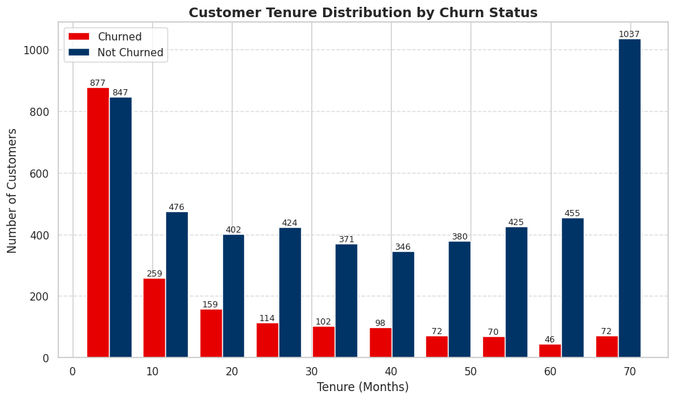
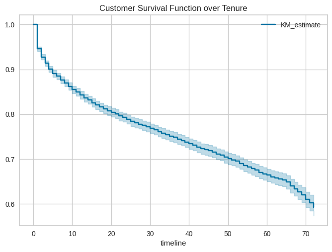
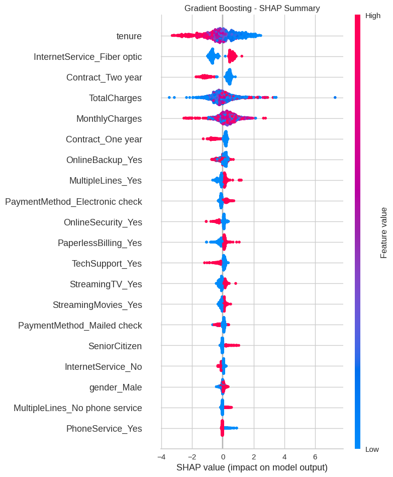
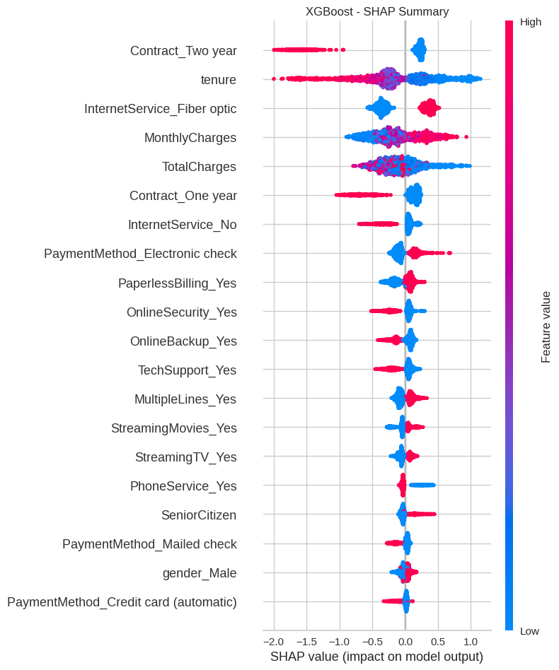

# Telco Customer Churn Prediction

## Project Overview

**Telecom Customer Churn Prediction** is a machine learning project that aims to accurately predict customer churn for a telecommunications company. By analysing customer behaviour and service usage patterns, the model identifies key indicators of churn, enabling businesses to take proactive retention measures.

This project is intended for **data scientists**, **business analysts**, and **telecom decision-makers** looking to minimize customer loss through data-driven insights. It is particularly useful for organizations aiming to improve customer satisfaction and loyalty using predictive analytics.

The project involves implementing and comparing **Gradient Boosting** and **XGBoost** classifiers, with advanced techniques such as **SMOTEENN** for class balancing and **GridSearchCV**/**RandomizedSearchCV** for hyperparameter optimization. Emphasis is placed on transparency through verbose outputs and performance tuning, ultimately identifying **XGBoost** as the most effective model, achieving an accuracy of **95.80%**.

Dataset

The dataset used in this project is the [Telco Customer Churn dataset](https://www.google.com/url?q=https%3A%2F%2Fwww.kaggle.com%2Fblastchar%2Ftelco-customer-churn), which contains information about customers, including their demographics, services subscribed to, and whether they churned or not.

## Project Structure/Methodology

The project is structured as follows:

1. **Data Loading and Exploration:** Loading the dataset and performing initial data exploration to understand the data distribution and identify missing values.
2. **Data Preprocessing:** Handling missing values, converting data types, and encoding categorical features.
3. **Exploratory Data Analysis (EDA):** Visualizing the data to understand the relationships between features and the target variable (Churn).
4. **Model Training and Evaluation:** Training various classification models and evaluating their performance using appropriate metrics.
5. **Hyperparameter Tuning:** Optimizing the hyperparameters of the best-performing models to further improve their performance.
6. **Model Interpretation:** Using SHAP values to interpret the best-performing models and understand the important features influencing churn.

## Dependencies

The following libraries are required to run this project:

You can install them using pip:

| pandas |
| --- |
| numpy |
| scipy |
| matplotlib |
| seaborn |
| scikit-learn |
| smoteen |
| Grid search cv |
| Reandomized search cv |
| imbalanced-learn |
| xgboost |
| Gradient boosting |
| shap |

## Analysis

### Overall Churn Customers

### Customer Tenure Distribution by Churn Status

### Customer Survival Function over Tenure

## Results

### Shap Summary for Gradient Boosting

### Shap Summary for XGBoost

## Key Insights from Both Models

**Gradient Boosting Insights:**

- **Tenure** emerges as the dominant protective factor against churn
- **Two-year contracts** provide substantial churn protection
- **Higher charges** (monthly/total) strongly correlate with increased churn risk
- **Fiber optic customers** show paradoxically higher churn rates despite premium service

**XGBoost Insights:**

- **Tenure** confirms strongest retention factor across algorithms
- **Contract hierarchy** shows two-year > one-year > month-to-month protection
- **Pricing sensitivity** remains consistent churn driver
- **Service differentiation** reinforces Fiber optic churn vulnerability

**Model Performance Comparison**

Both models demonstrate **strong predictive alignment** with similar feature importance rankings, providing confidence in identified churn patterns. However, they exhibit distinct characteristics in their approach to prediction.

**Gradient Boosting** shows **wider SHAP value distributions** across features, indicating it captures more complex, non-linear relationships between variables. The model demonstrates **greater sensitivity to feature interactions**, particularly visible in how service add-ons (streaming, security, backup) interact with pricing variables. It exhibits **more pronounced outlier detection**, with extended tails in SHAP distributions suggesting better identification of edge cases.

**XGBoost** provides **tighter, more concentrated SHAP distributions** around zero, indicating more stable and consistent predictions. The model shows **cleaner feature separation** with less noise in feature interactions, making it more interpretable for business stakeholders. It demonstrates **better regularization** of less important features, keeping their impact closer to zero while amplifying truly significant predictors. The **more symmetric SHAP distributions** suggest balanced treatment of positive and negative feature contributions.

## Conclusion

**Cross-model validation** reveals that both algorithms agree on the top 4 most important features, with correlation coefficients above 0.85 for feature rankings. **Performance stability** is higher in XGBoost, while **feature interaction depth** is superior in Gradient Boosting.

## Future Recommendations

**Ensemble approach** combining both models could leverage XGBoost's stability with Gradient Boosting's interaction detection capabilities. **Feature engineering** should focus on creating tenure-based segments and contract transition patterns to capture customer lifecycle dynamics. **Real-time scoring** implementation using XGBoost for production due to its superior stability and interpretability.
